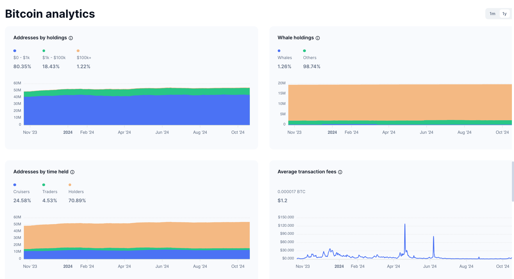
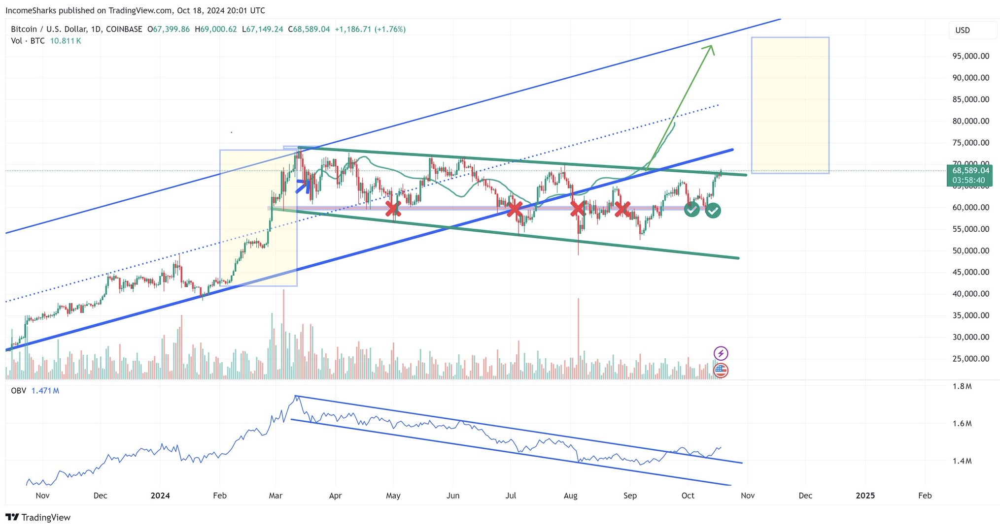

# Cryptocurrency Market Analysis

## Overview
This repository provides an in-depth analysis of the Bitcoin and altcoin markets, covering technical price trends, market dominance, key metrics, emerging trends, and major risk factors. The data is drawn from various sources, including [Arkham Intelligence](https://platform.arkhamintelligence.com/explorer/token/bitcoin), CoinMarketCap, and TradingView, among others. The analysis covers major altcoins like Ethereum, Binance Coin (BNB), Ripple (XRP), and Solana, alongside key sectors such as DeFi, NFTs, and Layer 1 solutions.

## Contents
- [Bitcoin Market Analysis](#bitcoin-market-analysis)
- [Altcoin Market Analysis](#altcoin-market-analysis)
- [Emerging Trends](#emerging-trends-in-the-altcoin-market)
- [Risk Factors](#risk-factors-and-challenges)

## Bitcoin Market Analysis

### 1. Bitcoin Analytics - Market Overview

*Figure 1: Distribution of Bitcoin holders across different address sizes.*

Bitcoin ownership is widespread but often distributed across smaller addresses, with 80.35% of holders having less than $1,000 in Bitcoin. Despite this, whale holders (addresses holding large amounts) control 1.26% of addresses but hold a significant portion of the total supply. This dynamic allows whales to have outsized market influence.

#### Key Insights:
- Majority of addresses hold small amounts of Bitcoin.
- Whale addresses, though fewer in number, have a substantial market influence.
- Long-term holding is dominant, with 70.89% of addresses showing consistent accumulation.

### 2. Cold and Hot Wallets - Bitcoin Holder Insights
According to [Arkham Intelligence](https://platform.arkhamintelligence.com/explorer/token/bitcoin), the top Bitcoin holders are primarily cold wallets, often associated with exchanges or institutional investors. Hot wallets, which are frequently used for trading and transactions, represent a smaller share but handle a higher volume of transfers.

#### Key Holders:
- **Cold Wallets**: Secure long-term storage, typically owned by exchanges like Binance and Coinbase. These wallets hold massive amounts of Bitcoin and rarely move funds, signifying long-term confidence.
- **Hot Wallets**: More frequently used for transactions, generally controlled by exchanges or active traders. They hold a smaller share but have higher transaction volume.

### 3. Bitcoin Price Technical Analysis - 2023/2024 Trend

*Figure 2: Price trends and technical analysis from November 2023 through October 2024.*

Bitcoin has experienced a breakout from a long-term consolidation range, signaling bullish momentum. Increased On-Balance Volume (OBV) suggests growing buying pressure, possibly leading to a price target of $75,000 in the coming months.

---

## Altcoin Market Analysis

### 1. Introduction to Altcoins
Altcoins encompass a wide variety of cryptocurrencies, each designed to address different use cases beyond Bitcoin. Categories include utility tokens like Ethereum, meme coins like Dogecoin, and stablecoins like USDT.

### 2. Altcoin Market Overview
Altcoins encompass a wide variety of cryptocurrencies, each designed to address different use cases beyond Bitcoin. Categories include utility tokens like Ethereum, meme coins like Dogecoin, and stablecoins like USDT.

Below is a pie chart that visualizes the market cap distribution by sector, highlighting how different types of altcoins contribute to the overall cryptocurrency market:

*Figure 3: Pie chart showing market cap distribution of different altcoin sectors.*

#### Key Altcoin Sectors:
- **DeFi (Decentralized Finance)**: Tokens used for decentralized financial applications like lending, borrowing, and trading without intermediaries. Examples: Uniswap (UNI), Aave (AAVE).
- **NFT (Non-Fungible Tokens)**: Tokens representing ownership of unique assets, particularly in gaming, art, and entertainment. Examples: Flow (FLOW), Chiliz (CHZ).
- **Stablecoins**: Cryptocurrencies designed to maintain a stable value, often backed by fiat currencies. Examples: Tether (USDT), USD Coin (USDC).
- **Layer 1 Solutions**: Foundational blockchains on which decentralized applications are built. Examples: Ethereum (ETH), Solana (SOL), Avalanche (AVAX).
- **Memecoins**: Cryptocurrencies often based on internet memes. Examples: Dogecoin (DOGE), Shiba Inu (SHIB).

---

## Emerging Trends in the Altcoin Market

Several trends are driving the evolution of the altcoin market:
1. **Layer 2 Scaling Solutions**: Platforms like Polygon aim to reduce transaction fees and increase scalability.
2. **Meme Coin Frenzy**: Coins like Shiba Inu and PEPE show the impact of viral internet trends.
3. **Cross-Chain Interoperability**: Projects like Polkadot and Cosmos are enabling blockchains to communicate with each other.

For more detailed information, check out:
- [Medium - Cryptocurrency Trends 2025](https://medium.com/@linhptadamo/cryptocurrency-trends-2025-embrace-the-future-9e348b4e134b)
- [Blockworks](https://blockworks.co/)

---

## Risk Factors and Challenges

While the altcoin market presents lucrative opportunities, there are several risks to consider:
- **Volatility**: Altcoins tend to be more volatile than Bitcoin.
- **Regulatory Uncertainty**: Government actions could impact altcoin markets.
- **Scam Tokens**: The rise of scam tokens and rug pulls is a growing concern.

For more information on risk factors, visit:
- [MoneySmart - Scam Tokens Overview](https://moneysmart.gov.au/financial-scams/crypto-scams)
- [CoinDesk - Crypto Risks](https://www.coindesk.com/tag/crypto-regulation)

---

## Conclusion and Future Outlook

The altcoin market continues to evolve, with growing influence from DeFi, NFTs, and cross-chain interoperability. Although volatile, the market shows strong potential for growth, especially for long-term investors.

For future trends and predictions:
- [Messari - Altcoin Market Predictions](https://messari.io/)
- [ForexLive - Future of Altcoins](https://www.forexlive.com/Education/is-investing-in-altcoins-the-future-20241018/)
