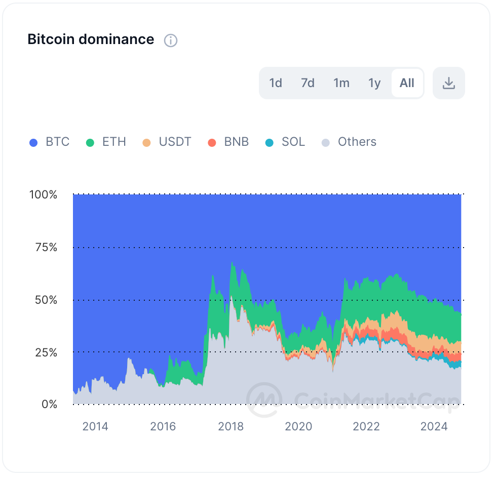

# Crypto-Market-Analysis
This repository contains comprehensive research and analysis on cryptocurrency market trends, token security, DeFi projects, and blockchain technologies.
## 2. Bitcoin Dominance - Long-Term Market Trends

  
*Figure 2: Bitcoin's dominance compared to other major cryptocurrencies like Ethereum, BNB, and USDT.*

### Description:
This chart tracks the dominance of Bitcoin (BTC) relative to other cryptocurrencies. Over time, Bitcoin's dominance has seen significant fluctuations, particularly as Ethereum, stablecoins (like USDT), an
